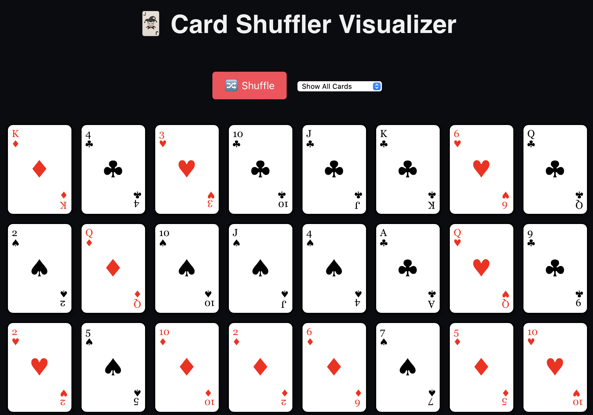
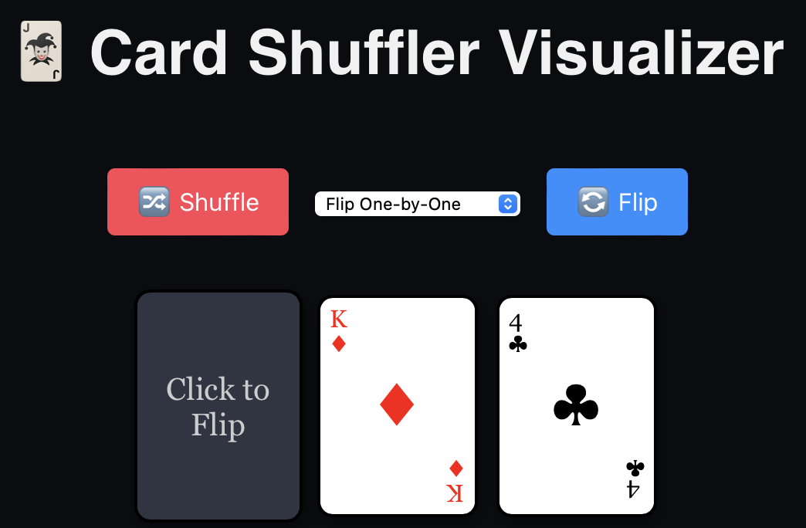
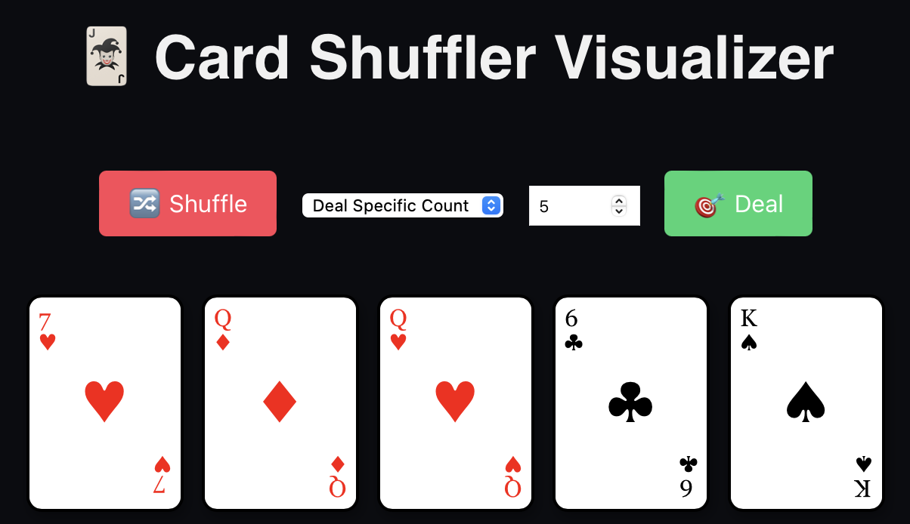

# 🃏 Card Shuffler Visualizer

Welcome to the **Card Shuffler Visualizer** – a sleek and interactive web app that simulates the shuffling and dealing of a real deck of 52 playing cards (no Jokers). Whether you're studying programming, building a game, or just fascinated by card mechanics, this project provides a fun and visually engaging experience.

## 📸 Screenshots





---

## 🚀 Features

- 🔀 **Fisher-Yates shuffle algorithm** for truly randomized decks
- 🃏 **Visual playing cards** styled like a real deck
- 💫 **Card animations**: flip one by one or deal a set number
- 🎮 **Interactive UI**:
  - Show all cards
  - Flip one-by-one from the deck
  - Deal a specific number of cards
- 🎨 Clean, elegant design with smooth transitions – no TailwindCSS required!

---

## 📸 Demo

[👉 Live Demo on Netlify](https://cardshufflerta.netlify.app) *([replace with your actual URL](https://cardshufflerta.netlify.app))*

---

## 🧠 How It Works

The app simulates a standard 52-card deck using a combination of:
- `suits` = Hearts, Diamonds, Clubs, Spades
- `faces` = A, 2-10, J, Q, K

It then:
1. Generates the deck.
2. Shuffles it using Fisher-Yates.
3. Displays cards based on the selected mode:
   - **Show All**
   - **Flip One-by-One**
   - **Deal N Cards**

All cards are styled using custom CSS and flipped or animated using React state management.

---

## 🛠️ Tech Stack

- **React** (Create React App)
- **JavaScript (ES6+)**
- **CSS3** (custom animations & card styles)
- **HTML5**

---

## 🧑‍💻 Run Locally

```bash
git clone https://github.com/TrishaAndres/card-shuffler.git
cd card-shuffler
npm install
npm start
```

